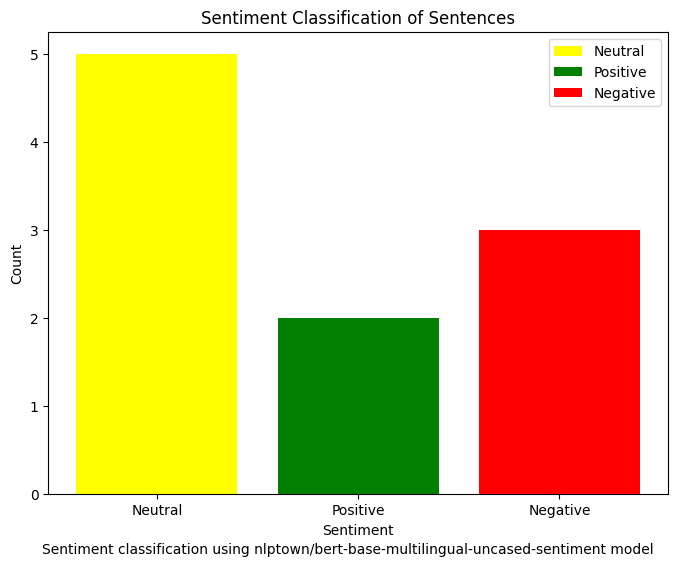

# Sentiment Classification of Sentences

This project classifies the sentiment of a list of sentences using a pre-trained BERT model (`nlptown/bert-base-multilingual-uncased-sentiment`) from Hugging Face. The model predicts the sentiment on a scale from 0 to 4 stars, which is then classified into three categories: Positive, Neutral, or Negative.

## Requirements

- Python 3.x
- Libraries:
  - `transformers`
  - `matplotlib`
  - `collections`
  
Install the required libraries using pip:
```bash
pip install transformers matplotlib
```
## Code Overview
Sentiment Analysis: The pipeline from the transformers library is used to classify each sentence. The model provides a star rating (0 to 4) for each sentence.

## Classification:

Sentences with 0-2 stars are classified as Negative.
Sentences with 3 stars are classified as Neutral.
Sentences with 4 stars are classified as Positive.
Visualization: A bar chart is generated to visualize the distribution of sentiments (Positive, Neutral, Negative).

## Output
After running the code, the sentiment classification of each sentence is displayed in the terminal along with the star rating and confidence score. A bar chart showing the distribution of sentiments is also generated.

## Example Output

Sentence: 'The website is easy to navigate, but the checkout process is slow.'
Predicted Sentiment: Neutral (Stars: 3, Confidence: 0.91)

Sentence: 'I love the fabric quality, but the stitching is poor.'
Predicted Sentiment: Negative (Stars: 2, Confidence: 0.86)

## Output Image

Below is the sentiment distribution bar chart:



This chart shows the classification of sentiments: 
- **Positive** in green
- **Neutral** in yellow
- **Negative** in red
